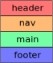
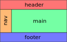
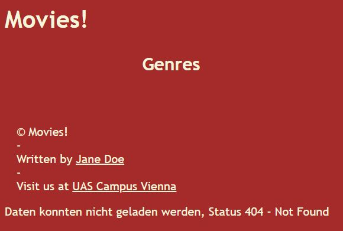
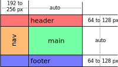
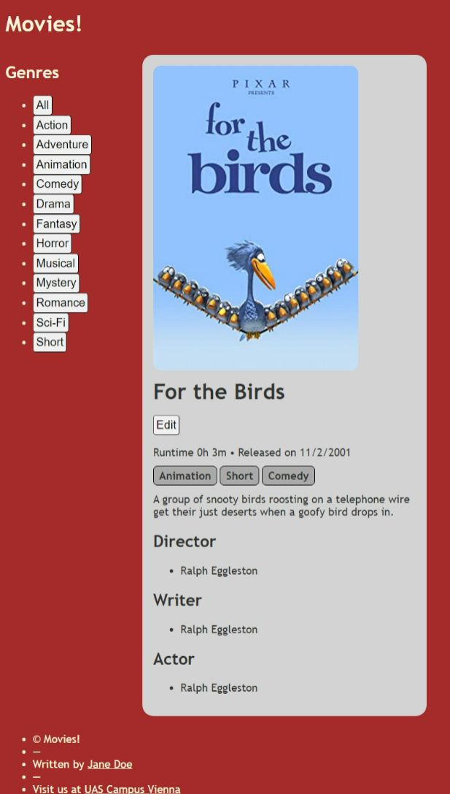
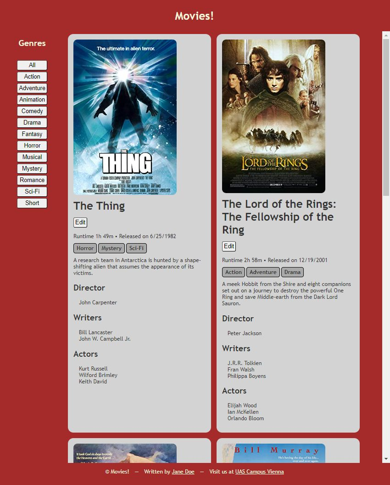

# Web Technologies - Exercise 3

The third exercise is mainly about styling, but also about semantic HTML and a new endpoint on the server. As usual, you find detailed information about these parts in the **Tasks** section below.

To set up your working environment for the project, you will have to perform the same steps you already used in exercise 1 and 2. First, you **clone** the project and configure it in an IDE, then you **install** the project's dependencies. To do so, run 

    npm install

in the project's root directory, where this `README.md` file is located. 

Use 

    npm start

or using `nodemon` (the **recommended** option)

    npm run start-nodemon

to start the server. In any case the server will be running on port 3000. You should see the message

    Server now listening on http://localhost:3000/

in your terminal. Navigate to [http://localhost:3000/](http://localhost:3000/) to test the application manually.

## Project structure

Our starting point for exercise 3 is a solution of exercise 2. 

On the server-side, we have our `movie-model.js`, containing our initial movie data. In `server.js` you will find the server startup code defining the three endpoint we have so far, `GET /movies`, `GET /movies/:imdbID`, and `PUT /movies/:imdbID`.

On the client-side, we have two HTML documents, namely `index.html` and `edit.html`. Both reference their respective JavaScript and CSS files, e.g. `index.html` references `index.js` and `index.css`.

The two CSS files are based on a common CSS file named `base.css`, which they both import.

In addition, there is a new JavaScript file named `builders.js`, which is imported by `index.js` and contains classes to build HTMLElements using the [Builder Pattern](https://en.wikipedia.org/wiki/Builder_pattern). 

Here is an overview of all the files:

**Server-side**
+ `server/server.js` containing the start up code and the endpoints,
+ `server/movie-model.js` will contain the data structure in which the movies are held.

**Client-side**:
+ `server/files/index.html` the overview page showing all movies,
+ `server/files/index.js` JavaScript code of `index.html`
+ `server/files/index.css` stylesheet for `index.html` file.
+ `server/files/edit.html` the movie edit page,
+ `server/files/edit.js` JavaScript code of `edit.html`.
+ `server/files/edit.css` stylesheet for `edit.html`
+ `server/files/base.css` common base stylesheet for `index.css` and `edit.css`
+ `server/files/builder.js` HTML element builders imported and used in `index.js`

## Tasks

Here's a first overview of the three tasks, details follow below:

1. Using HTML Landmark elements we restructure our `body` to like this:

    

    Then, using our knowledge about DOM manipulation and XMLHttpRequests, we dynamically add buttons to the `nav` element for the movie genres that exist.

2. In this task we are going to use CSS Grid Template Areas to change our layout to look like this:

    

    This does not mean that we change the structure in our DOM, we are simply changing the layout using CSS!

    Also, we make the genre buttons (that we added in task 1) work.

3. Finally, we lay out the contents of our elements using CSS Flexbox. We will center the content of the `header`, and lay out the contents of `nav`,`footer`, and `main` either horizontally or vertically.

### Checking your implementation
As usual, to check whether your implementation is working as expected you **run** Cypress end-to-end tests. These tests are the exact same tests used to assess your implementation once you commit it to the GitHub repository. This time there are 11 of them, 2 of which already work. These two test whether the movie data on the server exists and is returned correctly from the `GET \movies`, in case you want to change the movie data 😊.

To start the tests, run

    npm run cypress

As always, use the configured test specification file `cypress/e2e/assessment.cy.js` to run the tests.

Here is the scheme of how the subtasks contribute to the tasks 1, 2, and 3:

+ 0.1. (Already works) movie-model.js exports the movies object containing at least 3 movies
+ 0.2. (Already works) GET endpoint /movies returns at least three correctly formatted movies
+ 1.1. 'index.html' has specified semantic structure: **0.3 points**
+ 1.2. GET endpoint /genres returns a sorted list of genres: **0.3 points**
+ 1.3. Genres are added to the DOM correctly: **0.4 points**
+ 2.1. 'body', 'header', 'nav', 'main' and 'footer' are styled with grid template areas: **0.5 points**
+ 2.2. Genre buttons trigger loading and rendering of genre specific movies: **0.5 points**
+ 3.1. 'h1' element is centered inside of 'header' element: **0.25 points**
+ 3.2. Navigation buttons are below each other and have some gap: **0.25 points**
+ 3.3. Movie 'article' elements are laid out using Flexbox: **0.25 points**
+ 3.4. The footer is a Flexbox container, its childs are centered vertically **0.25 points**

### Task 1: Structure the overview page using semantic HTML, add navigation to genre specific movies

**1.1 In `index.html`.** Up until now, we added the `article` elements containing the movie data directly to the `body` element of our page. Now, we want this basic page structure to change.

Add the following elements with the specified content:
* A `header` element containing an `h1` with some text to your liking, e.g. `My movies!`
* A `nav` element containing an `h2` with the text `Genres` and an `ul`, in which we will later add the list items for the individual genres.
* A `main` element, which for now is empty. In here we are going to add our movie `article` elements from now on instead of adding them to the `body`
* A `footer` element containing an unordered list and five list items containing the following
    * A copyright symbol (&copy;) and your title, e.g. `My Movies!`
    * A separator to your liking, like &#8213;
    * How to reach the author using email. Needs to include a link with a `mailto:` URL.
    * Another separator, e.g., &#8213;
    * A link to our UAS, e.g. `https://www.fh-campuswien.ac.at/` opening in a new browsing context

After this task and for the time being, the page's elements will be laid out vertically and look something like this:

**1.2 In `server.js`.** Add the `GET /genres` endpoint to the server

The new endpoint returns the list of genres in your movie collection sorted alphabetically. 

E.g., You have three movies in your model and these have genres
* `Action`, `Adventure`, `Drama`,
* `Comedy`, `Drama`, `Fantasy` and
* `Drama`, `Romance`.

Then for these movies your endpoints returns `["Action", "Adventure", "Comedy", "Drama", "Fantasy", "Romance"]`.

**1.3. In `index.js`.** Add buttons to the `nav` for all genres. Include one for *all* movies.

In 1.1., you added an unordered list to the `nav` element. When the `XMLHttpRequest` add the end of `index.js` return the genres, add a list item (`li`) containing a button element (`button`) for each genre returned from the server. In addition, add a list item containing a button element for *all* the genres at the beginning of the list.

For the example above, e.g., the genres, "Action", "Adventure", "Comedy", "Drama", "Fantasy", and "Romance", you would add the following buttons:
* *All*: will load *all* movies
* *Action*: will load movies with genre *Action*
* *Adventure*: will load movies with genre *Adventure*

    ... more buttons for *Comedy*, *Drama*, *Fantasy* ...
* *Romance*: the last button, will load movies with genre *Romance*

Add click handlers to all buttons that call the function `loadMovies(...)`, which is already implemented in `index.js`. 

### Task 2: Applying Grid Template Areas to lay out our overview page, make the genre buttons work

**2.1. In `index.css`**. A Grid Container.

Laying out a container using Grid Template Areas is a three step process, both are implemented in `index.css`.

1. We specify an element to be a Grid container and specify the areas the container will use. In project, the `body` element is the Grid container.

    Specify the `display` property and the rows, columns and areas to correspond to the following layout:

    

2. Now, assign the areas defined in the container in step 1 to the child elements of our container. These are `header`, `nav`, `main`, and `footer`.

    When you finished this task, the look of the page will have already changed:

    

3. We want the footer to be visible always, for this to work we have to control how the `main` element behaves once its contents get to big to fit on the viewport. Set the `main` element's `overflow-y` property to `auto` to see the difference. 

Most probably you now see two scrollbars at the right, one for the `main` element, one for the `body`. We will take care of that later.

**2.2. In `index.js` and `server.js`.**
Review the implementation of `loadMovies(...)` in `index.js` and pass on the genre given by the button click handler to the movie request. 
* On the client-side, you need set the parameter to the request. See [URLSearchParams:set()](https://developer.mozilla.org/en-US/docs/Web/API/URLSearchParams/set). **Important: Use 'genre' as the name of your parameter!**
* On the server-side, in the `GET /movies` endpoint, you use the query parameter sent by the client to filter the movies of the collection. Like the path parameters we used in exercise 2, the query parameters also are available on the request object of the endpoint hit, e.g., a query parameter named **genre** will be available through `req.query.genre`. 

    Make sure that the endpoint returnes *all* movies when no query parameters is present and the genre specific movies when is is present.

After this task, all the page content will be laid out vertically, like this:

### Task 3: Using Flexbox to lay out elements

**3.1. In index.css.** Center the `h1` in the header.
One of the use cases of the Flexbox is to center a single child element in its parent's box.

Make the `header` a Flexbox container (`display` is `flex`) and specify the `justify-content` as well as the `align-items` to center the `h1` horizontally and vertically.

**3.2. In index.css.** Now, make the `ul` element in `nav` a Flexbox container, use the `nav>ul` child combinator selector.

Flexbox's default direction is `row`, set it to `column` for this container, in addition use a row gap of 4 to 8 pixels.

**3.3. In index.css.** Next is the `main` container, which houses the movie `article` elements.

We want it to be a Flexbox container as well, in this container we want the children to be wrapped, use `flex-wrap` to do so.

Make the main element a flex container that wraps its children and
   that has row direction. Add some background image that covers the whole area.
   Put your background image in the files/images folder.

**3.4. In index.css.** Last, but not least. The footer's `ul` element.

As a selector, again use a child combinator, `footer>ul`. Make sure to center the footer's elements horizontally and add a `column-gap` of 16 to 32 pixels.

Now it's finally time to get rid of the unnecessary scrollbar of the body. Set the body's `margin` to **0**, that should do it.

**Done, congratulations!** Don't forget to push and check on GitHub!